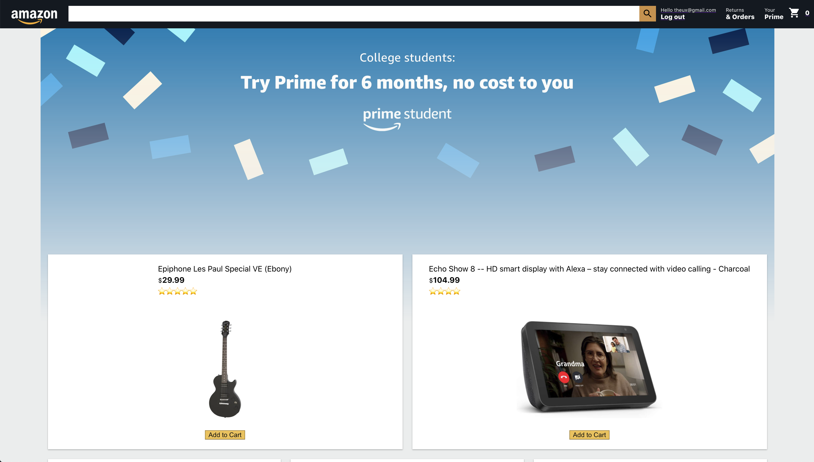

## Amazon [Ecommerce Side-Project]

The challenge? I want Amazon running on my localhost.

- Frontend: Build "the most accurate, the best" user interface inspired on Amazon only using CSS-SASS-MaterialUI skills. Also, I've integrated Redux/Redux toolkit/Redux Thunk to manage a big ecommerce redux store.

- Backend: Firebase is used as database + authentication solutions. Geolocation Api used to show prices in local currencies. Stripe has been added as payment solution (needs login). Using any name + credit card number 4444-4444-4444-4444 you can simulate payment.

Live Demo: https://aries-project-firebase.web.app/

Technologies used:
- React
- Firebase (auth & database)
- Redux
- Redux Toolkit
- Redux-Thunk
- Redux Dev Tools
- React-Router
- React-Router-Dom
- SASS
- Material UI
- Material Icons
- React Currency Format
- Stripe (for payments integration)

### Developed by Andres Nieves
